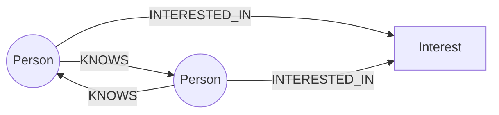
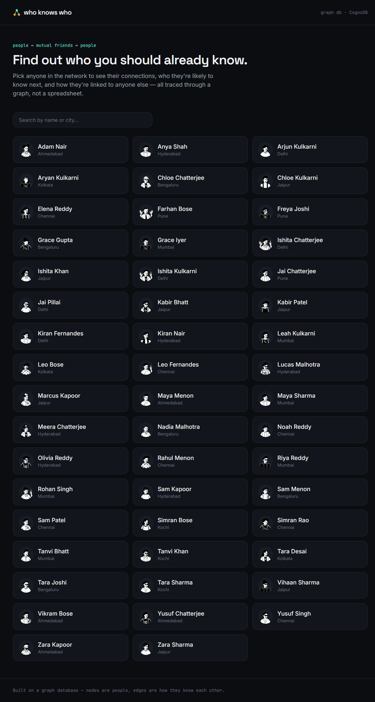
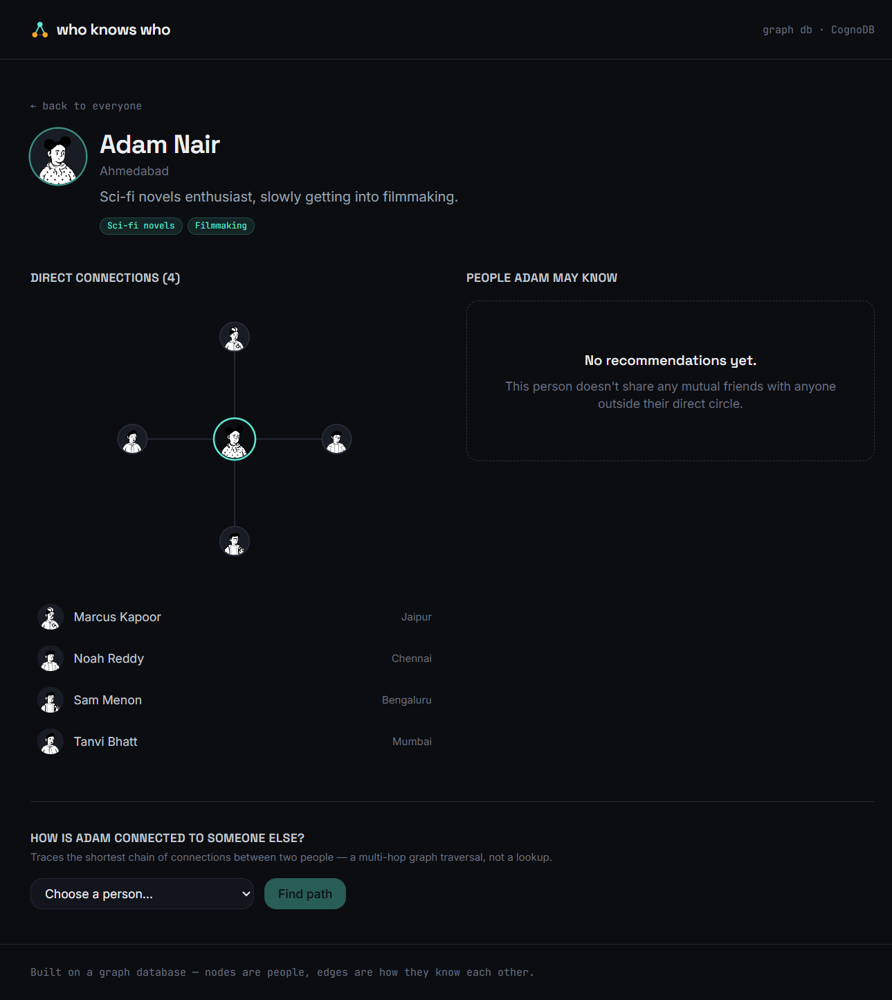
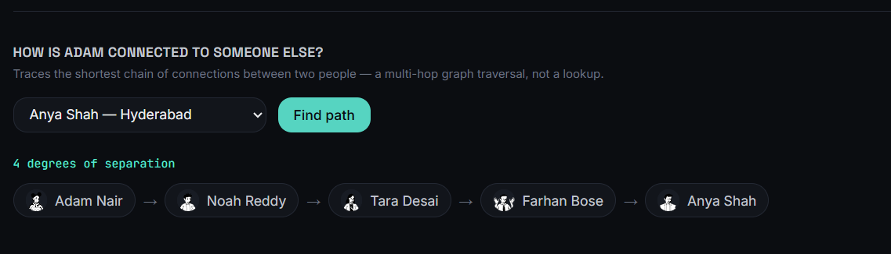

# who knows who

A small social graph explorer: pick anyone in the network and see their direct
connections, who they're likely to know next ("people you may know"), and the
shortest chain of connections between them and anyone else. Built on
**CognoDB** (a managed, Neo4j-protocol-compatible graph database) with a
Next.js app on top.

## Why a graph database?

The whole point of this app is **paths between people**, not records about
people. Three things a relational schema handles badly and a graph database
handles natively:

- **"People you may know"** means: friends of my friends, who I'm not already
  friends with, ranked by how many mutual friends we share. In SQL that's a
  self-join on a `friendships` table for every hop, plus an `EXCEPT`/`NOT
  EXISTS` anti-join to remove existing friends, and it gets slower and uglier
  with every additional hop you want to consider. In Cypher it's one
  `MATCH` pattern: `(me)-[:KNOWS]->(mutual)-[:KNOWS]->(candidate)`.
- **"How are these two people connected?"** is a variable-length path with no
  fixed hop count known in advance. In SQL this needs a recursive CTE with
  manual cycle detection. In Cypher: `shortestPath((a)-[:KNOWS*..6]-(b))`.
- **The schema grows sideways, not down.** Adding "shared interests" as a
  second reason to recommend someone didn't require touching the friendship
  logic at all — it's just another relationship pattern (`INTERESTED_IN`)
  layered on top of the same traversal, instead of a new join table wired
  into every existing query.

None of this is impossible in Postgres — it's just that the *interesting*
queries here are all about relationship depth and shape, which is exactly
what a graph database is built to make simple and fast.

## Data model



- **`Person`** node: `id`, `name`, `location`, `bio`, `avatarSeed`
- **`Interest`** node: `name` (e.g. "Bouldering", "Chess")
- **`(:Person)-[:KNOWS]->(:Person)`** — created in both directions per pair,
  so it behaves as a mutual/undirected friendship
- **`(:Person)-[:INTERESTED_IN]->(:Interest)`** — many-to-many, used to boost
  and explain recommendations

Two uniqueness constraints keep the graph clean: `Person.id` and
`Interest.name`.

The seed data (`scripts/data.js`) generates ~50 people spread across five
overlapping "communities" (a workplace, a college cohort, a climbing gym, a
neighborhood, a book club) plus a handful of random bridge connections across
communities. That's what makes the recommendations meaningful — a
friend-of-a-friend in a *different* community is exactly the kind of
non-obvious suggestion the app is meant to surface.

## The main queries

**1. Get a person, their direct connections, and their interests**
(`app/api/people/[id]/route.js`) — one round trip, two `OPTIONAL MATCH`
clauses:

```cypher
MATCH (p:Person {id: $id})
OPTIONAL MATCH (p)-[:KNOWS]->(friend:Person)
OPTIONAL MATCH (p)-[:INTERESTED_IN]->(interest:Interest)
RETURN p, collect(DISTINCT friend) AS friends, collect(DISTINCT interest.name) AS interests
```

**2. "People you may know"** (`app/api/people/[id]/recommendations/route.js`)
— the 2-hop traversal at the center of the app, ranked by mutual-friend count
and shared interests:

```cypher
MATCH (me:Person {id: $id})-[:KNOWS]->(mutual:Person)-[:KNOWS]->(candidate:Person)
WHERE candidate <> me AND NOT (me)-[:KNOWS]->(candidate)
WITH me, candidate, collect(DISTINCT mutual) AS mutualFriends, count(DISTINCT mutual) AS mutualCount
OPTIONAL MATCH (me)-[:INTERESTED_IN]->(sharedInterest:Interest)<-[:INTERESTED_IN]-(candidate)
WITH candidate, mutualFriends, mutualCount, collect(DISTINCT sharedInterest.name) AS sharedInterests
RETURN candidate, mutualFriends, mutualCount, sharedInterests
ORDER BY mutualCount DESC, size(sharedInterests) DESC, candidate.name ASC
LIMIT 12
```

**3. "How are we connected?"** (`app/api/people/[id]/path/[targetId]/route.js`)
— the query a relational schema genuinely struggles with: an unbounded-until-
capped variable-length shortest path.

```cypher
MATCH (a:Person {id: $id}), (b:Person {id: $targetId})
MATCH path = shortestPath((a)-[:KNOWS*..6]-(b))
RETURN [n IN nodes(path) | n] AS pathNodes, length(path) AS degrees
```

All three (and every other query in the app) run through a single
`runQuery(cypher, params)` helper in `lib/neo4j.js` that always passes
parameters separately from the Cypher string — nothing is ever string-
concatenated into a query.

## Project structure

```
app/
  page.js                          Home — directory + client-side search
  person/[id]/page.js              Profile — connections, recommendations, path finder
  api/people/route.js              GET  /api/people
  api/people/[id]/route.js         GET  /api/people/:id
  api/people/[id]/recommendations/route.js   GET recommendations
  api/people/[id]/path/[targetId]/route.js   GET shortest path
lib/
  neo4j.js                         Driver singleton + query helper + error types
  apiError.js                      Turns driver errors into clean JSON responses
components/                        Avatar, EgoGraph (SVG), lists, loading/empty/error states
scripts/
  seed.js                          Wipes and reloads the graph from data.js
  data.js                          Deterministic seed-data generator
```

## Setup

### 1. Create your CognoDB instance

1. Sign up at [console.cognodb.com/signup](https://console.cognodb.com/signup) (free tier, no card required).
2. Create a free **c0** instance and pick a region.
3. Copy the connection URI (`bolt+s://<instance-id>.databases.cognodb.cloud`)
   and the generated password for user `cognodb` — the password is shown
   once, so save it now.

### 2. Configure environment variables

```bash
cp .env.example .env.local
```

Fill in `.env.local`:

```
COGNODB_URI=bolt+s://<your-instance-id>.databases.cognodb.cloud
COGNODB_USER=cognodb
COGNODB_PASSWORD=<your-generated-password>
```

`.env.local` is gitignored — it never gets committed.

### 3. Install dependencies and seed the graph

```bash
npm install
npm run seed
```

`npm run seed` connects with the official `neo4j-driver`, wipes any existing
`Person`/`Interest` nodes, creates uniqueness constraints, and loads ~50
people, their interests, and their `KNOWS` connections. Safe to re-run any
time.

### 4. Run it

```bash
npm run dev
```

Open [http://localhost:3000](http://localhost:3000).

## Deploying

Any Node host works; the app has no dependency on the filesystem or a
particular runtime. For a free option:

1. Push this repo to GitHub.
2. Import it into [Vercel](https://vercel.com/new).
3. Add the three `COGNODB_*` environment variables in the Vercel project
   settings (same values as `.env.local`).
4. Deploy.

## Screenshots

- Home Page


Profile & Connections


- Connection Path



## Notes on error handling

If the database is unreachable, paused, or misconfigured, every API route
returns a JSON error (`503` for connection failures, `500` for missing
config) instead of throwing — the UI shows an `ErrorState` with a retry
button rather than a blank screen or a stack trace.
